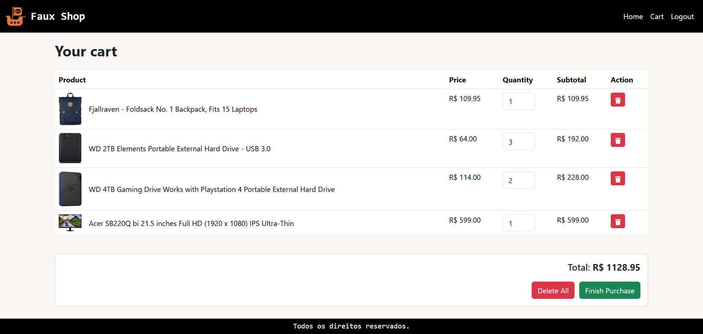
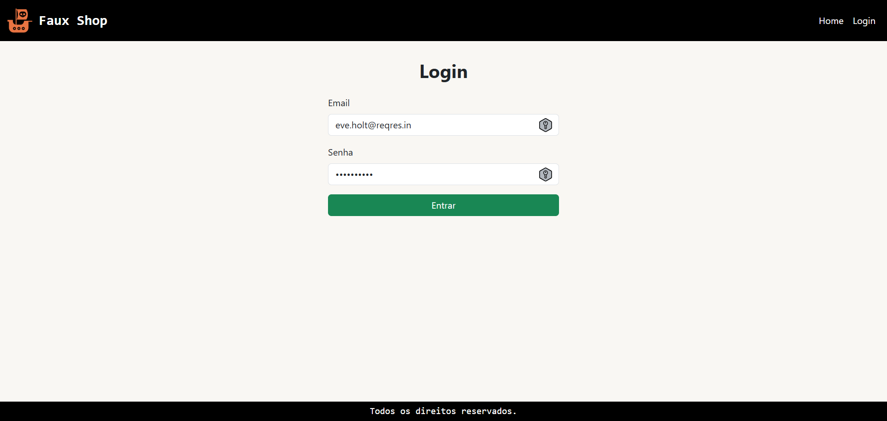

# 🐈 Villa Pet Hotel 🐕

    <b>Projeto desenvolvido para a disciplina Front-end com React [25E1_3] da Pós MIT em Desenvolvimento Full Stack do Infnet.</b>

---

## 🎨 Layout

    
    
    
    

---

## 💻 Tecnologias

- JavaScript
- React
